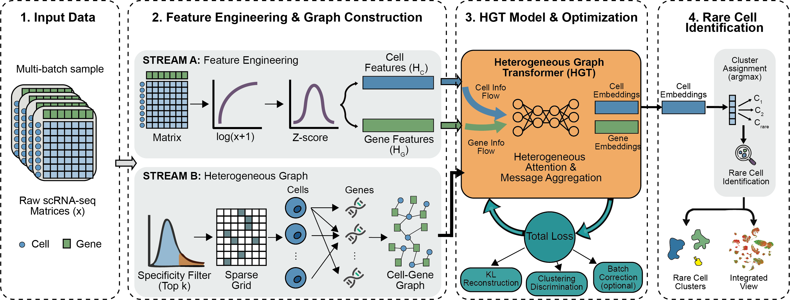

# scFormer: A heterogeneous graph transformer framework for rare cell identification in single-cell expression data



## Table of Contents
- [Introduction](#introduction)
- [Features](#features)
- [Installation](#installation)
- [Requirements](#requirements)
- [Example](#example)
- [Contributing](#contributing)

## Introduction
**scFormer** is a heterogeneous graph transformer (HGT) framework for identifying rare cell populations from single-cell transcriptomic data.  
The method explicitly encodes cell–gene relationships into a bipartite heterogeneous graph, where edges are weighted to emphasize cell-specific gene expression.  
Motivated by the observation that broadly expressed genes often contribute limited discriminative signal for resolving rare states, scFormer prioritizes highly specific genes as informative anchors, enabling rare-cell-relevant signals to be propagated through the graph topology rather than being diluted by dominant populations.  
This topology-aware design supports sensitive detection of rare transcriptional programs while maintaining scalability to large datasets.

## Features
- **Heterogeneous graph transformer modeling**: Represents cells and genes as distinct node types and performs attention-based message passing over a cell–gene heterogeneous graph.
- **Specificity-aware graph construction**: Up-weights cell-specific genes to enhance contrast for rare-state discovery.
- **Regularized training objective**: Incorporates label smoothing to improve robustness and generalization.
- **Scalable implementation**: Supports efficient training and inference for large single-cell datasets.
- **Modular design**: Provides a flexible architecture that can be extended to additional downstream tasks.

## Installation
1. **Clone the repository**
    ```bash
    git clone https://github.com/StickTaTa/ScFormer.git
    cd scformer
    ```

2. **Create a virtual environment (optional but recommended)**
    ```bash
    python -m venv env
    source env/bin/activate  # On Windows: env\Scripts\activate
    ```

3. **Install dependencies**
   Please refer to `requirements.txt` for package versions.

## Requirements
Our code was tested on Windows with the following hardware specifications:
- **CPU**: Intel(R) Core(TM) i9-14900KF
- **GPU**: NVIDIA GeForce RTX 4090 D
- **CUDA**: 11.8

Software requirements:
- Python 3.8+
- PyTorch 2.1.0
- NumPy
- SciPy
- tqdm

**Note**: Please ensure a compatible CUDA toolkit is installed to enable GPU acceleration.

## Example
A tutorial notebook is provided:
- [01_Tutorial_example.ipynb](https://github.com/StickTaTa/ScFormer/blob/main/Tutorial/01_Tutorial_example.ipynb): a minimal walkthrough on simulated data (500 cells).

## Contributing
Contributions are welcome. Please open an issue for questions/bugs and submit a pull request for improvements.
